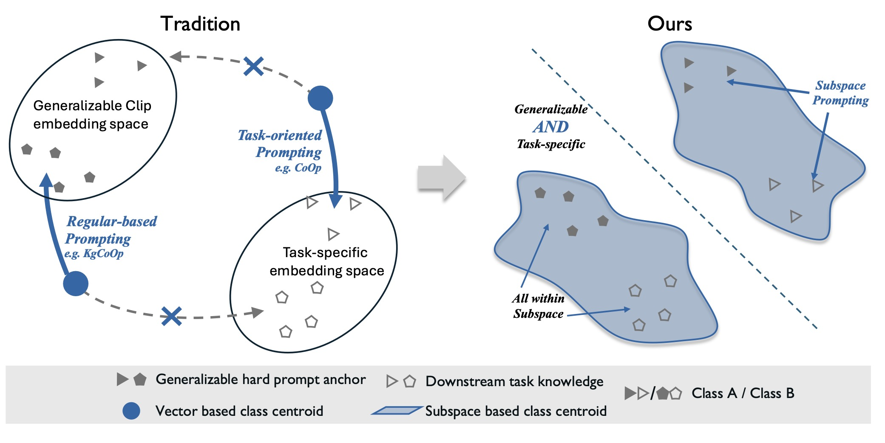
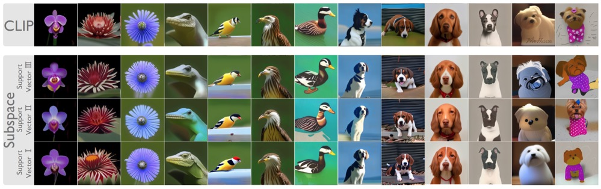
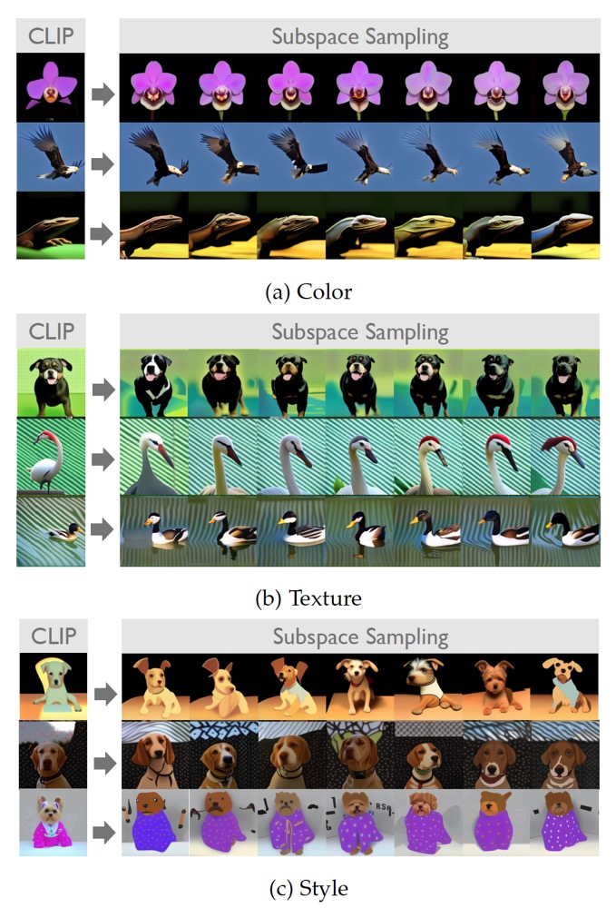

# Vision-Language **Su**bspace **Pr**ompting (SuPr) 

Official implementation of the paper: **"Vision-Language Subspace Prompting"**.

---

# 📚 Table of Contents
- [Vision-Language **Su**bspace **Pr**ompting (SuPr)](#vision-language-subspace-prompting-supr)
- [📚 Table of Contents](#-table-of-contents)
  - [🚀 News](#-news)
  - [✨ Introduction](#-introduction)
  - [📦 Supported Methods](#-supported-methods)
  - [📊 Results](#-results)
  - [🎨 Visualization](#-visualization)
  - [⚙️ Installation](#️-installation)
  - [📂 Data Preparation](#-data-preparation)
  - [🏛️ Model Zoo](#️-model-zoo)
  - [🏋️ Training](#️-training)
  - [📈 Evaluation](#-evaluation)
  - [📬 Contact](#-contact)
  - [🙏 Acknowledgements](#-acknowledgements)
  - [🔖 Citation](#-citation)

---

## 🚀 News
- **(April 27, 2025)**  
  - Released pre-trained models and evaluation scripts to reproduce SuPr's official benchmark results.  
  - Released training scripts for [SuPr](configs/trainers/SuPr).  
  - This repository also supports other prompting methods, including [DePT (CVPR'24)](configs/trainers/PromptSRC), [TCP (CVPR'24)](configs/trainers/TCP), [PromptSRC (ICCV'23)](configs/trainers/PromptSRC), [KgCoOp (CVPR'23)](configs/trainers/KgCoOp), [MaPLe (CVPR'23)](configs/trainers/MaPLe), [CoOp (IJCV'22)](configs/trainers/CoOp), and [Co-CoOp (CVPR'22)](configs/trainers/CoCoOp).

---

## ✨ Introduction



In adapting vision-language models like CLIP to downstream tasks, existing methods often struggle to balance task-specific objectives with the need to preserve CLIP’s generalizable embedding space. Traditional regularization techniques constrain optimization flexibility, limiting the adaptability of soft prompts to new tasks (left figure).  
In contrast, our **Subspace Prompting (SuPr)** method circumvents this tradeoff. It enables the integration of high-dimensional, semantically rich subspaces that simultaneously capture task-specific knowledge while retaining CLIP's generalizable features (right figure).

---

> **Abstract:**  
> Prompting vision-language models (e.g., CLIP) to adapt to downstream tasks has emerged as a crucial research topic. A prominent approach is context optimization, which replaces a subset of text tokens with learnable parameters, known as soft prompts. However, conventional pipelines leverage only a single vector embedding derived from these soft prompts for visual classification.  
> This design risks overfitting to base class training data and leads to degraded performance on novel classes. Previous works attempt to address this by regularizing soft prompts toward handcrafted hard prompts. Yet, excessive regularization hampers model adaptability on base classes.  
> 
> To strike a better balance, we introduce **SuPr**, a subspace-based prompting method. SuPr models a shared subspace between learnable soft prompts and textual hard prompts, enabling flexible yet structured adaptation. This approach achieves superior performance on both base and novel classes.  
> 
> With the advantages of subspace modeling, SuPr demonstrates strong effectiveness across diverse scenarios, including domain generalization, domain adaptation, cross-dataset transfer, and few-shot learning. Moreover, we provide extensive analysis by visualizing the learned subspace and applying SuPr to text-to-image generation tasks to understand the nature of the learned prompts.

---

## 📦 Supported Methods

| Method                    | Paper/Reference                                 | Configurations | Training Scripts |
|----------------------------|-------------------------------------------------|----------------|------------------|
| Independent V-L Prompting  | -                                               | [link](configs/trainers/IVLP/) | [link](scripts/independent-vlp) |
| CoOp                       | [IJCV 2022](https://arxiv.org/abs/2109.01134)   | [link](configs/trainers/CoOp)   | [link](scripts/coop) |
| Co-CoOp                    | [CVPR 2022](https://arxiv.org/abs/2203.05557)   | [link](configs/trainers/CoCoOp) | [link](scripts/cocoop) |
| MaPLe                      | [CVPR 2023](https://arxiv.org/abs/2210.03117)   | [link](configs/trainers/MaPLe)   | [link](scripts/maple) |
| KgCoOp                     | [CVPR 2023](https://openaccess.thecvf.com/content/CVPR2023/html/Yao_Visual-Language_Prompt_Tuning_With_Knowledge-Guided_Context_Optimization_CVPR_2023_paper.html) | [link](configs/trainers/KgCoOp/) | [link](scripts/kgcoop) |
| PromptSRC                  | [ICCV 2023](https://arxiv.org/abs/2307.06948)   | [link](configs/trainers/PromptSRC/) | [link](scripts/promptsrc) |
| TCP                        | [CVPR 2024](https://openaccess.thecvf.com/content/CVPR2024/html/Yao_TCPTextual-based_Class-aware_Prompt_tuning_for_Visual-Language_Model_CVPR_2024_paper.html) | [link](configs/trainers/TCP/) | [link](scripts/tcp) |
| DePT                       | [CVPR 2024](https://openaccess.thecvf.com/content/CVPR2024/html/Zhang_DePT_Decoupled_Prompt_Tuning_CVPR_2024_paper.html) | [link](configs/trainers/PromptSRC/) | [link](scripts/dept) |
| SuPr (ours)                | [arXiv](https://arxiv.org/abs/2307.06948)        | [link](configs/trainers/SuPr/) | [link](scripts/supr) |

---

## 📊 Results

| Model                     | Base Accuracy | Novel Accuracy | Harmonic Mean (HM) |
|----------------------------|:-------------:|:--------------:|:-----------------:|
| CLIP                       | 69.34         | 74.22          | 71.70             |
| Independent V-L Prompting  | 84.14         | 71.42          | 77.26             |
| **SuPr (Ours)**            | **84.15**     | **76.48**      | **80.13**         |

---

## 🎨 Visualization

SuPr's subspace modeling captures diverse intra-class variations, including fine-grained features like color, texture, and depiction style. This enables richer semantic representations compared to traditional soft prompts, which often focus only on dominant concepts. Additionally, interpolations within the subspace reveal smooth semantic transitions along various attributes.






---

## ⚙️ Installation

Please follow the instructions in [INSTALL.md](docs/INSTALL.md) for environment setup and package requirements.

---

## 📂 Data Preparation

Datasets required for training and evaluation can be prepared by following [DATASETS.md](docs/DATASETS.md).

---

## 🏛️ Model Zoo

| Configurations | Model Checkpoints |
|----------------|:-----------------:|
| [SuPr](configs/trainers/SuPr/vit_b16_ep10_batch4_4+4ctx.yaml) | [link](https://huggingface.co/tongyujun/Subspace_Prompting/tree/main/weights/SuPr) |
| [SuPr + PromptSRC](configs/trainers/SuPr/vit_b16_ep20_batch4_4+4ctx_promptsrc.yaml) | [link](https://huggingface.co/tongyujun/Subspace_Prompting/tree/main/weights/SubspacePromptSRC) |
| [SuPr Ens](configs/trainers/SuPr/vit_b16_ep10_batch4_4+4ctx.yaml) | [link](https://huggingface.co/tongyujun/Subspace_Prompting/tree/main/weights/SuPrEns) |

---

## 🏋️ Training

Please refer to [TRAIN.md](docs/TRAIN.md) for detailed instructions on training SuPr, PromptSRC, and IVLP baselines from scratch.

---

## 📈 Evaluation

Please refer to [EVAL.md](docs/EVAL.md) for reproducing official results using our pre-trained models.

---

## 📬 Contact

For questions, issues, or discussions, please open an issue in this repository or contact: **tongyujun@bupt.edu.cn**

---

## 🙏 Acknowledgements

Our codebase builds upon and extends the following repositories:  
- [PromptSRC](https://github.com/muzairkhattak/PromptSRC)
- [MaPLe](https://github.com/muzairkhattak/multimodal-prompt-learning)
- [CoOp and Co-CoOp](https://github.com/KaiyangZhou/CoOp)  

We sincerely thank the authors for sharing their codebases. If you find our work useful, please also consider citing these related works.

---

## 🔖 Citation

If you find our work useful, please consider citing:

```bibtex
@misc{supr2025,
  title={Vision-Language Subspace Prompting},
  author={Your Name and Collaborators},
  year={2025},
  eprint={2307.06948},
  archivePrefix={arXiv},
  primaryClass={cs.CV}
}
